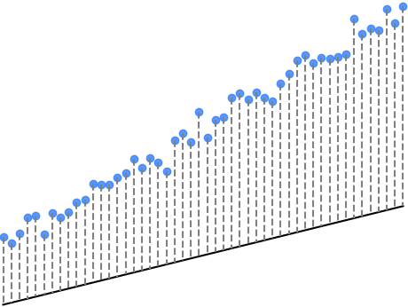
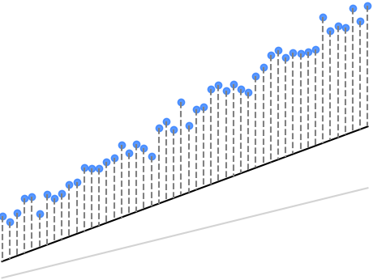
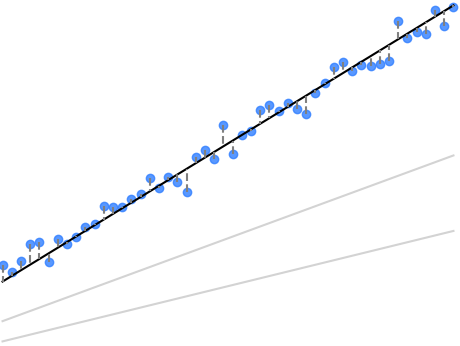

# Understanding Linear Regression

Linear Regression is one of the simplest yet most applicable algorithms in machine learning due to the large range of real-life patterns and datasets that are linearly related. It's often the first stepping stone in the journey of learning machine learning. This section will explain what linear regression is, how it works, and its fundamental principles.

## 2.1 What is Linear Regression?

Linear Regression is a statistical method used to model the relationship between a dependent variable and a independent variable. The basic idea is to find a linear relationship or a straight line that best fits the data.

### Mathematical Representation
The linear relationship in linear regression is often represented as:
<code-block>
y=mx+b
</code-block>

where:
- `y` is the dependent variable.
- `x` is the independent variable.
- `m` is the slope of the line.
- `b` is the y-intercept.

## 2.2 Working of Linear Regression

Linear regression works by modifying the slope `m`  and the intercept `b` to adjust the line of best fit. The goal is to find a line that minimizes the differences between the `y` values predicted by the line for the given `x` values and the actual observed `y` values that correspond to the given `x` values. This process is known as *minimizing the error* or *cost function*.

### Visualization of Linear Regression {collapsible="true"}

Below is an example of an iterative working out of linear regression, in which the slope and intercept are adjusted over three iterations in the direction that is lowering the loss. In this case, the loss is the sum of the errors (or differences) between the scatterplot points and the points predicted by the line at various `x` values. 

In this visualization, the errors are depicted by the vertical dashed lines, the lengths of which naturally correspond to their magnitudes. The goal of linear regression is to find a line (a slope-intercept value pair) that minimizes the errors represented by the dashed lines. 

We can see this occurring over the course of the regression iterations: the sum of the errors gradually approaches 0.

<table>
    <tr>
        <td>Iteration 1</td>
        <td>Iteration 2</td>
        <td>Iteration 3</td>
    </tr>
    <tr>
        <td>
Slope (m): 2

Intercept (b): 5
</td>
        <td>
Slope (m): 3

Intercept (b): 7
</td>
        <td>
Slope (m): 5

Intercept (b): 10
</td>
    </tr>
    <tr>
        <td>Sum of Errors: <format style="bold" color="LightPink">26958.82</format></td>
        <td>Sum of Errors: <format style="bold" color="LightPink">11982.34</format></td>
        <td>Sum of Errors: <format style="bold" color="LightGreen">128.66</format></td>
    </tr>
<tr><td></td><td></td><td></td></tr>
</table>

### Steps in Linear Regression
1. **Choosing the Right Data**: Selecting relevant variables and data points that can be reasonably expected to be linearly related.
2. **Fitting the Model**: Finding the best values for \( m \) and \( b \).
3. **Making Predictions**: Once the model is fitted, it can be used to make predictions on new data.

## 2.3 Assumptions of Linear Regression

To effectively use linear regression, certain assumptions are made:
- Linearity: The relationship between the variables is linear.
- Homoscedasticity: The residuals (the errors/differences between observed and predicted values) are equally spread along the regression line.
- Independence: Observations are independent of each other.
- Normality: The residuals should be normally distributed.

## 2.4 Limitations of Linear Regression
While powerful, linear regression has its limitations:
- It assumes a linear relationship between variables, which is not always the case.
- It can be prone to outliers which can significantly impact the regression line.
- It does not work well with non-linear data without transformation.

> **Real World Example**
>
> Imagine predicting house prices based on their size. The house size (independent variable `x`) and price (dependent variable `y`) often have a linear relationship, making linear regression a suitable model for this prediction.
{style="note"}

## Conclusion

Linear regression, with its simplicity and ease of interpretation, serves as an excellent foundation for understanding more complex machine learning algorithms. In the next section, "Applying Linear Regression to Machine Learning," we will explore how to practically implement linear regression in a machine learning context.

---
